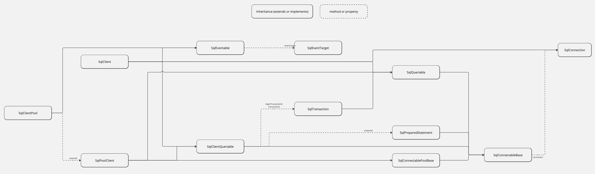

# RFC: @std/sql - Standardized SQL Database Interface Specification

This RFC proposes a standardized interface for SQL-like database drivers.

## Overview

In the ever-evolving landscape of web development, the need for robust,
efficient, and standardized database connectivity is paramount. SQL-based
databases remain a cornerstone of data storage and retrieval in countless
applications, ranging from small-scale personal projects to large-scale
enterprise systems. However, the current ecosystem of JavaScript database
drivers for SQL-based databases is highly fragmented, leading to inconsistent
and often incompatible interfaces across different drivers.

Similar effort has been made in the
[Go ecosystem](https://pkg.go.dev/database/sql), and can therefore be used for
guidance.

Link to the specs: https://github.com/halvardssm/deno_stdext/tree/feat/sql

## Purpose

The primary purpose of this specification is to define a universal interface
that allows developers to interact with SQL-based databases in a consistent
manner, regardless of the underlying database management system (DBMS). By
providing a standardized interface, this specification aims to:

- Simplify Development: Reduce the complexity for developers who need to
  interact with multiple SQL databases, enabling them to switch between
  different databases with minimal code changes.
- Enhance Interoperability: Foster greater compatibility between applications
  and database drivers, promoting a more seamless integration process.
- Improve Maintainability: Provide a clear and consistent framework that
  simplifies the maintenance and updating of database interaction code.

### Motivation

The motivation for this RFC comes from creating applications and scripts using
the database drivers available. Comparing the signatures of the different
database drivers, we see that they vary greatly and have little to no coherent
usage. Thus the motivation is to create a coherent base interface (that can be
extended) that can be implemented across database drivers.

Below there is a comparison of how to execute a query in the different drivers
taken from the respective readmes.

**Node: mysql** ([link](https://github.com/mysqljs/mysql))

```ts
var mysql = require("mysql");

var connection = mysql.createConnection({
  host: "localhost",
  user: "me",
  password: "secret",
  database: "my_db",
});
connection.connect();
connection.query("SELECT 1 + 1 AS solution", function (error, results, fields) {
  if (error) throw error;
  console.log("The solution is: ", results[0].solution);
});
connection.end();
```

**Node: mysql2** ([link](https://github.com/sidorares/node-mysql2))

```ts
import mysql from "mysql2/promise";

const connection = await mysql.createConnection({
  host: "localhost",
  user: "root",
  database: "test",
});
const [results, fields] = await connection.query("SELECT 1 + 1 AS solution");
console.log(results[0]);
connection.end();
```

**Node: sqlite3** ([link](https://github.com/TryGhost/node-sqlite3))

```ts
const sqlite3 = require("sqlite3").verbose();
const db = new sqlite3.Database(":memory:");

db.serialize(() => {
  db.get("SELECT 1 + 1 AS solution", (err, row) => {
    console.log(row);
  });
});

db.close();
```

**Node: better-sqlite3** ([link](https://github.com/WiseLibs/better-sqlite3))

```ts
import Database from "better-sqlite3";
const db = new Database("foobar.db", options);

const row = db.prepare("SELECT 1 + 1 AS solution").get(userId);
console.log(row.solution);
```

**Node: pg** ([link](https://github.com/brianc/node-postgres))

```ts
import pg from "pg";
const { Client } = pg;
const client = new Client();
await client.connect();

const res = await client.query("SELECT 1 + 1 AS solution");
console.log(res.rows[0].solution);
await client.end();
```

**Node: postgres** ([link](https://github.com/porsager/postgres))

```ts
import postgres from "postgres";

const sql = postgres({
  /* options */
});
const res = await sql`SELECT 1 + 1 AS solution`;
console.log(res[0].solution);
```

**Deno: mysql** ([link](https://github.com/denodrivers/mysql/))

```ts
import { Client } from "https://deno.land/x/mysql/mod.ts";
const client = await new Client().connect({
  hostname: "127.0.0.1",
  username: "root",
  db: "dbname",
  password: "password",
});
const res = await client.query(`SELECT 1 + 1 AS solution`);
console.log(res.rows[0].solution);
```

**Deno: sqlite** ([link](https://github.com/denodrivers/sqlite3))

```ts
import { Database } from "jsr:@db/sqlite@0.11";

const db = new Database("test.db");

const [solution] = db.prepare("SELECT 1 + 1 AS solution").value<[string]>()!;
console.log(solution);
db.close();
```

**Deno: postgres** ([link](https://github.com/denodrivers/postgres))

```ts
import { Client } from "https://deno.land/x/postgres/mod.ts";
const client = new Client({
  user: "user",
  database: "test",
  hostname: "localhost",
  port: 5432,
});
await client.connect();
const result = await client.queryObject`SELECT 1 + 1 AS solution`;
console.log(result.rows[0].solution);
await client.end();
```

## Scope

This specification covers the essential components and functionalities required
for interacting with SQL-based databases through a standardized interface. It
includes, but is not limited to:

- Connection management
- Query execution
- Transaction handling
- Error handling and reporting
- Data type mappings
- Prepared statements and parameterized queries

> Other functionalities such as subscriptions would be out of scope for the
> first version, but would be considered for upcoming spec releases.

## Goals and Non-Goals

- Define a clear and comprehensive API for database drivers that can be
  universally applied to all SQL-based databases.
- Ensure that the interface is flexible enough to support both basic and
  advanced SQL database functionalities, and that the interfaces can be extended
  for functionality that is not included in the specs.
- Promote the adoption of the standardized interface within the developer
  community and across database vendors.
- This specification does not aim to replace existing database drivers but
  rather to provide a layer of standardization that can be implemented by them.
- It does not cover non-SQL databases or seek to address database-specific
  optimizations and extensions that fall outside the scope of standard SQL
  operations. This should be handled by the respective drivers.

## Audience

This RFC is intended for database driver developers, application developers,
database administrators, and other stakeholders involved in the development and
maintenance of applications that interact with SQL-based databases. It provides
a framework for creating compatible and standardized database drivers,
facilitating smoother development and integration processes.

## Specification

The following section contains the main interfaces introduced in this RFC.

### Concept

#### Initiation of client

There are two types of clients, a Client used for a single connection, and a
ClientPool for when a pool of clients is needed. Both of these provide the same
base signature, although the `options` argument differs slightly in signature.

A client class takes two arguments, the first is a `connectionUrl` in the form
of a `string` or `URL`, and the second is an optional `options` object. After
instantiating a client, the connection needs to be established using the
`connect` method available on the client.

```ts
const client = new Client(connectionUrl, connectionOptions);
await client.connect();
```

When a connection is no longer needed, it must be closed by the `close` method.

```ts
await client.close();
```

The client interface also utilizes the proposed
[Explicit Resource Management](https://github.com/tc39/proposal-explicit-resource-management)
to automatically dispose of the connection.

```ts
await using client = new Client(connectionUrl, connectionOptions);
await client.connect();
// no need to close the connection at the end
```

The `ClientPool` works in a similar way. The clients can either be eagerly or
lazily connected when calling the `connect` method. The `PoolClient`s can then
be acquired when needed.

```ts
const pool = new ClientPool(connectionUrl, connectionOptions);
await pool.connect();
const client = await pool.acquire(); // returns a PoolClient class (subset of Client interface)
```

After a client is no longer needed, it must be released back to the pool using
the `release` method.

```ts
await client.release();
```

When the pool is no longer needed, it must be closed by the `close` method. The
`close` method will close all the connections in the pool.

```ts
await client.close();
```

Using
[Explicit Resource Management](https://github.com/tc39/proposal-explicit-resource-management),
no manual release or close is needed.

```ts
await using pool = new ClientPool(connectionUrl, connectionOptions);
await pool.connect();
await using client = await pool.acquire();
// no need to release the client at the end
// no need to close the pool at the end
```

#### Querying the database

The client provides the following methods for querying.

- `execute`: Executes a SQL statement
- `query`: Queries the database and returns an array of object
- `queryOne`: Queries the database and returns at most one entry as an object
- `queryMany`: Queries the database with an async generator and yields each
  entry as an object. This is good for when you want to iterate over a massive
  amount of rows.
- `queryArray`: Queries the database and returns an array of arrays
- `queryOneArray`: Queries the database and returns at most one entry as an
  array
- `queryManyArray`: Queries the database with an async generator and yields each
  entry as an array. This is good for when you want to iterate over a massive
  amount of rows.
- `sql`: Allows you to create a query using template literals, and returns the
  entries as an array of objects. This is a wrapper around `query`
- `sqlArray`: Allows you to create a query using template literals, and returns
  the entries as an array of arrays. This is a wrapper around `queryArray`

See the [examples](#examples) section for sample usage.

#### Prepared statement

A prepared statement can also be created with the provided method.

- `prepare`: Returns a `PreparedStatement` class

The `PreparedStatement` class provides a subset of the client methods for
querying.

- `execute`: Executes a SQL statement
- `query`: Queries the database and returns an array of object
- `queryOne`: Queries the database and returns at most one entry as an object
- `queryMany`: Queries the database with an async generator and yields each
  entry as an object. This is good for when you want to iterate over a massive
  amount of rows.
- `queryArray`: Queries the database and returns an array of arrays
- `queryOneArray`: Queries the database and returns at most one entry as an
  array
- `queryManyArray`: Queries the database with an async generator and yields each
  entry as an array. This is good for when you want to iterate over a massive
  amount of rows.

See the [examples](#examples) section for sample usage.

#### Transaction

Transactions are also supported by using the provided methods

- `beginTransaction`: Returns a `Transaction` class that implements the
  queriable functions, as well as transaction related functions
- `transaction`: A wrapper function for transactions, handles the logic of
  beginning, committing and rollback a transaction.

The `Transaction` class provides a subset of the client methods for querying,
and also provides the `prepare` method.

See the [examples](#examples) section for sample usage.

### Interfaces

The interfaces for each class are specified as follows.

> To see the full specification, take a look at the
> [code](https://github.com/halvardssm/deno_stdext/tree/feat/sql/sql).

```ts
interface PreparedStatement {
  /**
   * Deallocate the prepared statement
   */
  deallocate(): Promise<void>;

  /**
   * Executes the prepared statement
   *
   * @param params the parameters to bind to the SQL statement
   * @param options the options to pass to the query method, will be merged with the global options
   * @returns the number of affected rows if any
   */
  execute(
    params?: ParameterType[],
    options?: QueryOptions,
  ): Promise<number | undefined>;
  /**
   * Query the database with the prepared statement
   *
   * @param params the parameters to bind to the SQL statement
   * @param options the options to pass to the query method, will be merged with the global options
   * @returns the rows returned by the query as object entries
   */
  query<T extends Row<any> = Row<any>>(
    params?: ParameterType[],
    options?: QueryOptions,
  ): Promise<T[]>;
  /**
   * Query the database with the prepared statement, and return at most one row
   *
   * @param params the parameters to bind to the SQL statement
   * @param options the options to pass to the query method, will be merged with the global options
   * @returns the row returned by the query as an object entry, or undefined if no row is returned
   */
  queryOne<T extends Row<any> = Row<any>>(
    params?: ParameterType[],
    options?: QueryOptions,
  ): Promise<T | undefined>;
  /**
   * Query the database with the prepared statement, and return an iterator.
   * Usefull when querying large datasets, as this should take advantage of data streams.
   *
   * @param params the parameters to bind to the SQL statement
   * @param options the options to pass to the query method, will be merged with the global options
   * @returns the rows returned by the query as object entries
   */
  queryMany<T extends Row<any> = Row<any>>(
    params?: ParameterType[],
    options?: QueryOptions,
  ): AsyncGenerator<T>;
  /**
   * Query the database with the prepared statement
   *
   * @param params the parameters to bind to the SQL statement
   * @param options the options to pass to the query method, will be merged with the global options
   * @returns the rows returned by the query as array entries
   */
  queryArray<T extends ArrayRow<any> = ArrayRow<any>>(
    params?: ParameterType[],
    options?: QueryOptions,
  ): Promise<T[]>;
  /**
   * Query the database with the prepared statement, and return at most one row
   *
   * @param sql the SQL statement
   * @param params the parameters to bind to the SQL statement
   * @param options the options to pass to the query method, will be merged with the global options
   * @returns the row returned by the query as an array entry, or undefined if no row is returned
   */
  queryOneArray<T extends ArrayRow<any> = ArrayRow<any>>(
    params?: ParameterType[],
    options?: QueryOptions,
  ): Promise<T | undefined>;

  /**
   * Query the database with the prepared statement, and return an iterator.
   * Usefull when querying large datasets, as this should take advantage of data streams.
   *
   * @param params the parameters to bind to the SQL statement
   * @param options the options to pass to the query method, will be merged with the global options
   * @returns the rows returned by the query as array entries
   */
  queryManyArray<T extends ArrayRow<any> = ArrayRow<any>>(
    params?: ParameterType[],
    options?: QueryOptions,
  ): AsyncGenerator<T>;
}

interface Transaction {
  /**
   * Commit the transaction
   */
  commitTransaction(
    options?: TransactionOptions["commitTransactionOptions"],
  ): Promise<void>;

  /**
   * Rollback the transaction
   */
  rollbackTransaction(
    options?: TransactionOptions["rollbackTransactionOptions"],
  ): Promise<void>;

  /**
   * Create a save point
   *
   * @param name the name of the save point
   */
  createSavepoint(name?: string): Promise<void>;

  /**
   * Release a save point
   *
   * @param name the name of the save point
   */
  releaseSavepoint(name?: string): Promise<void>;

  /**
   * Execute a SQL statement
   *
   * @param sql the SQL statement
   * @param params the parameters to bind to the SQL statement
   * @param options the options to pass to the query method, will be merged with the global options
   * @returns the number of affected rows if any
   */
  execute(
    sql: string,
    params?: ParameterType[],
    options?: QueryOptions,
  ): Promise<number | undefined>;

  /**
   * Query the database
   *
   * @param sql the SQL statement
   * @param params the parameters to bind to the SQL statement
   * @param options the options to pass to the query method, will be merged with the global options
   * @returns the rows returned by the query as object entries
   */
  query<T extends Row<any> = Row<any>>(
    sql: string,
    params?: ParameterType[],
    options?: QueryOptions,
  ): Promise<T[]>;

  /**
   * Query the database and return at most one row
   *
   * @param sql the SQL statement
   * @param params the parameters to bind to the SQL statement
   * @param options the options to pass to the query method, will be merged with the global options
   * @returns the row returned by the query as an object entry, or undefined if no row is returned
   */
  queryOne<T extends Row<any> = Row<any>>(
    sql: string,
    params?: ParameterType[],
    options?: QueryOptions,
  ): Promise<T | undefined>;

  /**
   * Query the database and return an iterator.
   * Usefull when querying large datasets, as this should take advantage of data streams.
   *
   * @param sql the SQL statement
   * @param params the parameters to bind to the SQL statement
   * @param options the options to pass to the query method, will be merged with the global options
   * @returns the rows returned by the query as object entries
   */
  queryMany<T extends Row<any> = Row<any>>(
    sql: string,
    params?: ParameterType[],
    options?: QueryOptions,
  ): AsyncGenerator<T>;

  /**
   * Query the database
   *
   * @param sql the SQL statement
   * @param params the parameters to bind to the SQL statement
   * @param options the options to pass to the query method, will be merged with the global options
   * @returns the rows returned by the query as array entries
   */
  queryArray<T extends ArrayRow<any> = ArrayRow<any>>(
    sql: string,
    params?: ParameterType[],
    options?: QueryOptions,
  ): Promise<T[]>;

  /**
   * Query the database and return at most one row
   *
   * @param sql the SQL statement
   * @param params the parameters to bind to the SQL statement
   * @param options the options to pass to the query method, will be merged with the global options
   * @returns the row returned by the query as an array entry, or undefined if no row is returned
   */
  queryOneArray<T extends ArrayRow<any> = ArrayRow<any>>(
    sql: string,
    params?: ParameterType[],
    options?: QueryOptions,
  ): Promise<T | undefined>;

  /**
   * Query the database and return an iterator.
   * Usefull when querying large datasets, as this should take advantage of data streams.
   *
   * @param sql the SQL statement
   * @param params the parameters to bind to the SQL statement
   * @param options the options to pass to the query method, will be merged with the global options
   * @returns the rows returned by the query as array entries
   */
  queryManyArray<T extends ArrayRow<any> = ArrayRow<any>>(
    sql: string,
    params?: ParameterType[],
    options?: QueryOptions,
  ): AsyncGenerator<T>;

  /**
   * Query the database using tagged template
   *
   * @returns the rows returned by the query as object entries
   */
  sql<T extends Row<any> = Row<any>>(
    strings: TemplateStringsArray,
    ...parameters: ParameterType[]
  ): Promise<T[]>;

  /**
   * Query the database using tagged template
   *
   * @returns the rows returned by the query as array entries
   */
  sqlArray<T extends ArrayRow<any> = ArrayRow<any>>(
    strings: TemplateStringsArray,
    ...parameters: ParameterType[]
  ): Promise<T[]>;

  /**
   * Create a prepared statement that can be executed multiple times.
   * This is useful when you want to execute the same SQL statement multiple times with different parameters.
   *
   * @param sql the SQL statement
   * @param options the options to pass to the query method, will be merged with the global options
   * @returns a prepared statement
   */
  prepare(sql: string, options?: QueryOptions): PreparedStatement;
}

interface Client {
  /**
   * Create a connection to the database
   */
  connect(): Promise<void>;

  /**
   * Close the connection to the database
   */
  close(): Promise<void>;

  /**
   * Execute a SQL statement
   *
   * @param sql the SQL statement
   * @param params the parameters to bind to the SQL statement
   * @param options the options to pass to the query method, will be merged with the global options
   * @returns the number of affected rows if any
   */
  execute(
    sql: string,
    params?: ParameterType[],
    options?: QueryOptions,
  ): Promise<number | undefined>;

  /**
   * Query the database
   *
   * @param sql the SQL statement
   * @param params the parameters to bind to the SQL statement
   * @param options the options to pass to the query method, will be merged with the global options
   * @returns the rows returned by the query as object entries
   */
  query<T extends Row<any> = Row<any>>(
    sql: string,
    params?: ParameterType[],
    options?: QueryOptions,
  ): Promise<T[]>;

  /**
   * Query the database and return at most one row
   *
   * @param sql the SQL statement
   * @param params the parameters to bind to the SQL statement
   * @param options the options to pass to the query method, will be merged with the global options
   * @returns the row returned by the query as an object entry, or undefined if no row is returned
   */
  queryOne<T extends Row<any> = Row<any>>(
    sql: string,
    params?: ParameterType[],
    options?: QueryOptions,
  ): Promise<T | undefined>;

  /**
   * Query the database and return an iterator.
   * Usefull when querying large datasets, as this should take advantage of data streams.
   *
   * @param sql the SQL statement
   * @param params the parameters to bind to the SQL statement
   * @param options the options to pass to the query method, will be merged with the global options
   * @returns the rows returned by the query as object entries
   */
  queryMany<T extends Row<any> = Row<any>>(
    sql: string,
    params?: ParameterType[],
    options?: QueryOptions,
  ): AsyncGenerator<T>;

  /**
   * Query the database
   *
   * @param sql the SQL statement
   * @param params the parameters to bind to the SQL statement
   * @param options the options to pass to the query method, will be merged with the global options
   * @returns the rows returned by the query as array entries
   */
  queryArray<T extends ArrayRow<any> = ArrayRow<any>>(
    sql: string,
    params?: ParameterType[],
    options?: QueryOptions,
  ): Promise<T[]>;

  /**
   * Query the database and return at most one row
   *
   * @param sql the SQL statement
   * @param params the parameters to bind to the SQL statement
   * @param options the options to pass to the query method, will be merged with the global options
   * @returns the row returned by the query as an array entry, or undefined if no row is returned
   */
  queryOneArray<T extends ArrayRow<any> = ArrayRow<any>>(
    sql: string,
    params?: ParameterType[],
    options?: QueryOptions,
  ): Promise<T | undefined>;

  /**
   * Query the database and return an iterator.
   * Usefull when querying large datasets, as this should take advantage of data streams.
   *
   * @param sql the SQL statement
   * @param params the parameters to bind to the SQL statement
   * @param options the options to pass to the query method, will be merged with the global options
   * @returns the rows returned by the query as array entries
   */
  queryManyArray<T extends ArrayRow<any> = ArrayRow<any>>(
    sql: string,
    params?: ParameterType[],
    options?: QueryOptions,
  ): AsyncGenerator<T>;

  /**
   * Query the database using tagged template
   *
   * @returns the rows returned by the query as object entries
   */
  sql<T extends Row<any> = Row<any>>(
    strings: TemplateStringsArray,
    ...parameters: ParameterType[]
  ): Promise<T[]>;

  /**
   * Query the database using tagged template
   *
   * @returns the rows returned by the query as array entries
   */
  sqlArray<T extends ArrayRow<any> = ArrayRow<any>>(
    strings: TemplateStringsArray,
    ...parameters: ParameterType[]
  ): Promise<T[]>;

  /**
   * Create a prepared statement that can be executed multiple times.
   * This is useful when you want to execute the same SQL statement multiple times with different parameters.
   *
   * @param sql the SQL statement
   * @param options the options to pass to the query method, will be merged with the global options
   * @returns a prepared statement
   */
  prepare(sql: string, options?: QueryOptions): PreparedStatement;

  /**
   * Starts a transaction
   */
  beginTransaction(
    options?: TransactionOptions["beginTransactionOptions"],
  ): Promise<Transaction>;

  /**
   * Transaction wrapper
   *
   * Automatically begins a transaction, executes the callback function, and commits the transaction.
   *
   * If the callback function throws an error, the transaction will be rolled back and the error will be rethrown.
   * If the callback function returns successfully, the transaction will be committed.
   *
   * @param fn callback function to be executed within a transaction
   * @returns the result of the callback function
   */
  transaction<T>(fn: (t: Transaction) => Promise<T>): Promise<T>;
}

interface PoolClient {
  /**
   * Release the connection to the pool
   */
  release(): Promise<void>;

  /**
   * Execute a SQL statement
   *
   * @param sql the SQL statement
   * @param params the parameters to bind to the SQL statement
   * @param options the options to pass to the query method, will be merged with the global options
   * @returns the number of affected rows if any
   */
  execute(
    sql: string,
    params?: ParameterType[],
    options?: QueryOptions,
  ): Promise<number | undefined>;

  /**
   * Query the database
   *
   * @param sql the SQL statement
   * @param params the parameters to bind to the SQL statement
   * @param options the options to pass to the query method, will be merged with the global options
   * @returns the rows returned by the query as object entries
   */
  query<T extends Row<any> = Row<any>>(
    sql: string,
    params?: ParameterType[],
    options?: QueryOptions,
  ): Promise<T[]>;

  /**
   * Query the database and return at most one row
   *
   * @param sql the SQL statement
   * @param params the parameters to bind to the SQL statement
   * @param options the options to pass to the query method, will be merged with the global options
   * @returns the row returned by the query as an object entry, or undefined if no row is returned
   */
  queryOne<T extends Row<any> = Row<any>>(
    sql: string,
    params?: ParameterType[],
    options?: QueryOptions,
  ): Promise<T | undefined>;

  /**
   * Query the database and return an iterator.
   * Usefull when querying large datasets, as this should take advantage of data streams.
   *
   * @param sql the SQL statement
   * @param params the parameters to bind to the SQL statement
   * @param options the options to pass to the query method, will be merged with the global options
   * @returns the rows returned by the query as object entries
   */
  queryMany<T extends Row<any> = Row<any>>(
    sql: string,
    params?: ParameterType[],
    options?: QueryOptions,
  ): AsyncGenerator<T>;

  /**
   * Query the database
   *
   * @param sql the SQL statement
   * @param params the parameters to bind to the SQL statement
   * @param options the options to pass to the query method, will be merged with the global options
   * @returns the rows returned by the query as array entries
   */
  queryArray<T extends ArrayRow<any> = ArrayRow<any>>(
    sql: string,
    params?: ParameterType[],
    options?: QueryOptions,
  ): Promise<T[]>;

  /**
   * Query the database and return at most one row
   *
   * @param sql the SQL statement
   * @param params the parameters to bind to the SQL statement
   * @param options the options to pass to the query method, will be merged with the global options
   * @returns the row returned by the query as an array entry, or undefined if no row is returned
   */
  queryOneArray<T extends ArrayRow<any> = ArrayRow<any>>(
    sql: string,
    params?: ParameterType[],
    options?: QueryOptions,
  ): Promise<T | undefined>;

  /**
   * Query the database and return an iterator.
   * Usefull when querying large datasets, as this should take advantage of data streams.
   *
   * @param sql the SQL statement
   * @param params the parameters to bind to the SQL statement
   * @param options the options to pass to the query method, will be merged with the global options
   * @returns the rows returned by the query as array entries
   */
  queryManyArray<T extends ArrayRow<any> = ArrayRow<any>>(
    sql: string,
    params?: ParameterType[],
    options?: QueryOptions,
  ): AsyncGenerator<T>;

  /**
   * Query the database using tagged template
   *
   * @returns the rows returned by the query as object entries
   */
  sql<T extends Row<any> = Row<any>>(
    strings: TemplateStringsArray,
    ...parameters: ParameterType[]
  ): Promise<T[]>;

  /**
   * Query the database using tagged template
   *
   * @returns the rows returned by the query as array entries
   */
  sqlArray<T extends ArrayRow<any> = ArrayRow<any>>(
    strings: TemplateStringsArray,
    ...parameters: ParameterType[]
  ): Promise<T[]>;

  /**
   * Create a prepared statement that can be executed multiple times.
   * This is useful when you want to execute the same SQL statement multiple times with different parameters.
   *
   * @param sql the SQL statement
   * @param options the options to pass to the query method, will be merged with the global options
   * @returns a prepared statement
   */
  prepare(sql: string, options?: QueryOptions): PreparedStatement;

  /**
   * Starts a transaction
   */
  beginTransaction(
    options?: TransactionOptions["beginTransactionOptions"],
  ): Promise<Transaction>;

  /**
   * Transaction wrapper
   *
   * Automatically begins a transaction, executes the callback function, and commits the transaction.
   *
   * If the callback function throws an error, the transaction will be rolled back and the error will be rethrown.
   * If the callback function returns successfully, the transaction will be committed.
   *
   * @param fn callback function to be executed within a transaction
   * @returns the result of the callback function
   */
  transaction<T>(fn: (t: Transaction) => Promise<T>): Promise<T>;
}

interface ClientPool {
  /**
   * Create a connection to the database
   */
  connect(): Promise<void>;

  /**
   * Close the connection to the database
   */
  close(): Promise<void>;

  /**
   * Acquire a connection from the pool
   */
  acquire(): Promise<PoolClient>;
}
```

> To see the full specification, take a look at the
> [code](https://github.com/halvardssm/deno_stdext/tree/feat/sql/sql).

## Examples

Async dispose

```ts
await using client = new Client(connectionUrl, connectionOptions);
await client.connect();
await client.execute("SOME INSERT QUERY");
const res = await client.query("SELECT * FROM table");
```

Using const (requires manual close at the end)

```ts
const client = new Client(connectionUrl, connectionOptions);
await client.connect();
await client.execute("SOME INSERT QUERY");
const res = await client.query("SELECT * FROM table");
await client.close();
```

Query objects

```ts
const res = await client.query("SELECT * FROM table");
console.log(res);
// [{ col1: "some value" }]
```

Query one object

```ts
const res = await client.queryOne("SELECT * FROM table");
console.log(res);
// { col1: "some value" }
```

Query many objects with an iterator

```ts
const res = Array.fromAsync(client.queryMany("SELECT * FROM table"));
console.log(res);
// [{ col1: "some value" }]

// OR

for await (const iterator of client.queryMany("SELECT * FROM table")) {
  console.log(res);
  // { col1: "some value" }
}
```

Query as an array

```ts
const res = await client.queryArray("SELECT * FROM table");
console.log(res);
// [[ "some value" ]]
```

Query one as an array

```ts
const res = await client.queryOneArray("SELECT * FROM table");
console.log(res);
// [[ "some value" ]]
```

Query many as array with an iterator

```ts
const res = Array.fromAsync(client.queryManyArray("SELECT * FROM table"));
console.log(res);
// [[ "some value" ]]

// OR

for await (const iterator of client.queryManyArray("SELECT * FROM table")) {
  console.log(res);
  // [ "some value" ]
}
```

Query with template literals as an object

```ts
const res = await client.sql`SELECT * FROM table where id = ${id}`;
console.log(res);
// [{ col1: "some value" }]
```

Query with template literals as an array

```ts
const res = await client.sqlArray`SELECT * FROM table where id = ${id}`;
console.log(res);
// [[ "some value" ]]
```

Transaction

```ts
const transaction = await client.beginTransaction();
await transaction.execute("SOME INSERT QUERY");
await transaction.commitTransaction();
// `transaction` can no longer be used, and a new transaction needs to be created
```

Transaction wrapper

```ts
const res = await client.transaction(async (t) => {
  await t.execute("SOME INSERT QUERY");
  return t.query("SOME SELECT QUERY");
});
console.log(res);
// [{ col1: "some value" }]
```

Prepared statement

```ts
const prepared = db.prepare("SOME PREPARED STATEMENT");
await prepared.query([...params]);
console.log(res);
// [{ col1: "some value" }]
```

## Implementation

> This section is for implementing the interface for database drivers. For
> general usage, read the [usage](#usage) section.

To be fully compliant with the specs, you will need to implement the following
classes for your database driver:

- `Connection`: This represents the connection to the database. This should
  preferably only contain the functionality of containing a connection, and
  provide a minimum set of query methods to be used to query the database
- `PreparedStatement`: This represents a prepared statement.
- `Transaction`: This represents a transaction.
- `Client`: This represents a database client
- `ClientPool`: This represents a pool of clients
- `PoolClient`: This represents a client to be provided by a pool

It is also however advisable to create additional helper classes for easier
inheritance (see the [inheritance graph](#inheritance-graph)).

### Inheritance graph

Here is an overview of the inheritance and flow of the different interfaces. In
most cases, these are the classes and the inheritance graph that should be
implemented.



### Constructor Signature

The constructor must follow a strict signature.

The constructor for both the Client and the ClientPool follows the same
signature:

1. `connectionUrl`: string | URL
2. `options`?: ConnectionOptions & QueryOptions

As `ConnectionOptions` and `QueryOptions` can be extended, the options can be
used to customize the settings, thus having a standard 2 argument signature of
the constructor.

> The current way to specify a constructor using interfaces in TS, is to use a
> combination of `implements` and `satisfies`. This will be updated if anything
> changes.

#### Client

The Client must have a constructor following the signature specified by
`SqlClientConstructor`.

```ts
export const Client = class extends Transactionable implements SqlClient<...> { // Transactionable is a class implementing `SqlTransactionable`
  ...
  // The constructor now has to satisfy `SqlClientConstructor`
  constructor(
	connectionUrl: string | URL,
	options: ConnectionOptions & QueryOptions = {},
  ) {
	...
  }
  ...
} satisfies SqlClientConstructor<...>;

// We need to also export the instance type of the client
export type Client = InstanceType<typeof Client>;
```

#### ClientPool

The ClientPool must have a constructor following the signature specified by
`SqlClientPoolConstructor`.

```ts
const ClientPool = class extends Transactionable implements SqlClientPool<...> { // Transactionable is a class implementing `SqlTransactionable`
  ...
  // The constructor now has to satisfy `SqlClientPoolConstructor`
  constructor(
	connectionUrl: string | URL,
	options: ConnectionOptions & QueryOptions = {},
  ) {
	...
  }
  ...
} satisfies SqlClientPoolConstructor<...>;

// We need to also export the instance type of the client pool
export type ClientPool = InstanceType<typeof ClientPool>;
```

## Acknowledgment

Thanks to [kt3k](https://github.com/kt3k) and
[iuioiua](https://github.com/iuioiua) from the Deno team for support
